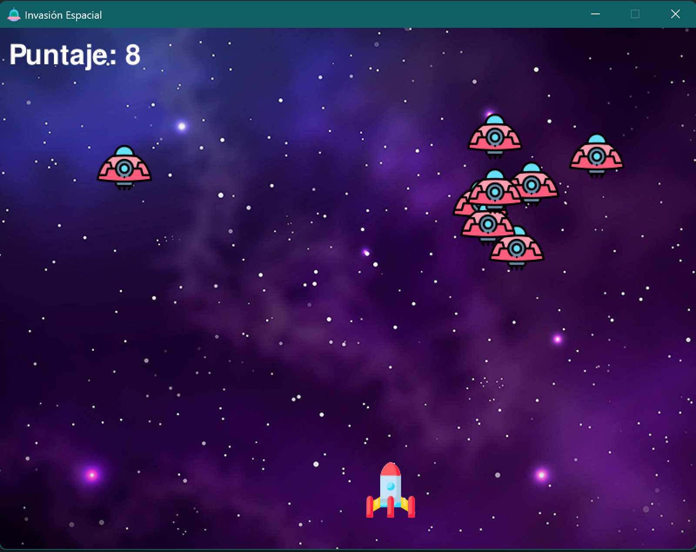

# Invasión Espacial - Juego en Python

## Descripción

Juego tipo arcade desarrollado con Pygame en Python.

El jugador controla una nave espacial que debe disparar a los enemigos mientras evita que lleguen a la parte inferior de la pantalla.

## Funcionalidades

- Movimiento del jugador con teclado
- Disparo de múltiples balas
- Generación de enemigos aleatorios
- Detección de colisiones
- Sistema de puntaje
- Pantalla de Game Over
- Efectos de sonido y música

## Tecnologías

- Python
- Pygame

## Autor

Aiko Marín

## Notas

Proyecto desarrollado como práctica de lógica de videojuegos, manejo de eventos y uso de librerías gráficas en Python.
